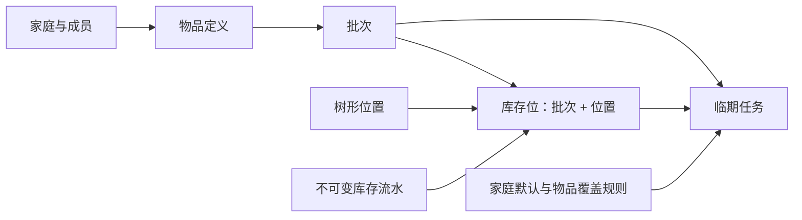
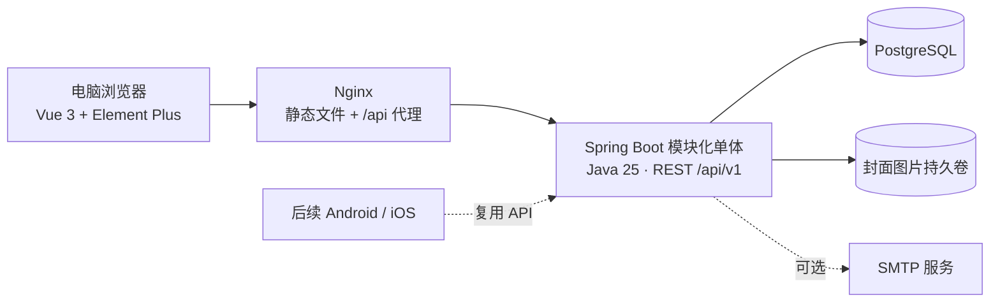
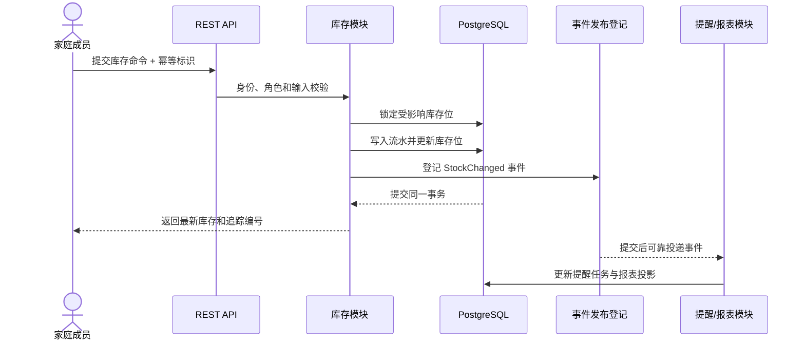

# 知家（zija）家庭物品管理系统设计方案

- **状态：** 已确认，作为实施计划与后续验收依据
- **日期：** 2026-07-18
- **最后修订：** 2026-07-19
- **首期形态：** 家庭私有部署的电脑端 Web 管理后台
- **产品名称：** 中文“知家”，英文“zija”

## 1. 方案摘要

知家是一套服务于单个家庭、多位成员的私有化物品与库存管理系统。首期重点不是覆盖所有家庭资产流程，而是可靠解决两个高频问题：**不知道还剩多少库存**，以及**不知道哪些批次即将过期**。

系统同时支持耐用品与消耗品。一个“物品”描述它是什么，一个“批次”描述某次购入或某件独立资产，一个“库存位”描述某批次在某个位置的当前数量，所有数量变化则由不可随意删除的库存流水记录。这个模型既能管理多批次牛奶、药品和清洁用品，也能管理数量为 1、带序列号的家电或数码设备。

技术上采用 API 优先的模块化单体：后端使用 Java 25、Spring Boot 4.1.x、MyBatis、MyBatis-Plus 和 PostgreSQL；前端使用 Vue 3、TypeScript 与 Element Plus；通过 Docker Compose 在 NAS、家庭服务器或云主机上私有部署。首期只交付桌面 Web 后台，但 REST API、认证边界和 OpenAPI 合约为后续 Android、iOS 客户端保留稳定接入点。

## 2. 设计目标与原则

### 2.1 产品目标

首期必须让家庭成员能够：

1. 快速登记耐用品和消耗品；
2. 按批次记录数量、购入或生产日期、到期日和存放位置；
3. 查看当前库存、低库存清单和临期清单；
4. 通过入库、领用、报损、盘点调整和移位维护库存；
5. 追溯任何库存数量由谁在何时、因何原因改变；
6. 通过首页待办、站内通知和可选邮件及时处理风险；
7. 导入、导出、备份和恢复家庭数据，避免数据锁定。

### 2.2 设计原则

- **数据正确优先：** 当前库存必须能够被流水解释和重建。
- **先到期先使用：** 领用时优先推荐到期日更早的批次，但允许成员改选。
- **高频动作最短路径：** 入库、领用、盘点和移位在任何主要页面都容易进入。
- **模块边界清晰：** 单体部署不等于业务代码相互穿透。
- **私有部署友好：** 不依赖云端服务也能完成全部核心流程。
- **API 优先：** Web 后台不使用后端内部特权接口，未来 App 复用同一业务 API。
- **渐进增强：** 首期不为尚未开发的移动端、AI 或 SaaS 提前引入分布式复杂度。

### 2.3 首期验收目标

- 新成员能在数分钟内完成物品和首个批次入库；
- 任一库存位的数量都能追溯到有效流水；
- 同一物品的不同到期批次可以独立查询和领用；
- 低库存或临期状态变化后，首页待办能及时更新；
- CSV 导入在落库前能展示错误行，错误数据不会部分写入；
- 一次完整备份可以在空环境中恢复数据库和封面图片。

## 3. 产品边界

### 3.1 目标用户与部署模式

- 一套部署只服务一个家庭；
- 一个家庭可以有多位成员；
- 主要部署环境是 NAS、家庭服务器或家庭自有云主机；
- 系统可以在不配置 SMTP 的情况下完整运行；
- 首期不提供官方托管、多租户隔离、计费或运营后台。

### 3.2 首期范围

- 家庭初始化、成员和角色；
- 用户名、密码和安全会话；
- 物品、分类、品牌、标签、计量单位和封面图片；
- 耐用品和消耗品；
- 多批次、到期日、序列号和备注；
- 树形位置与批次分散存放；
- 入库、领用、报损、盘点调整、移位和冲正流水；
- 当前库存位与批次库存汇总；
- 家庭默认提醒规则与物品级覆盖；
- 任务与风险首页、站内通知和可选邮件；
- 全局搜索、筛选、临期报表、低库存报表和库存变化报表；
- CSV 预检导入与导出；
- PostgreSQL 与封面图片的备份、恢复和升级说明；
- Docker Compose 私有部署。

### 3.3 首期明确不做

- 多家庭 SaaS、租户运营和收费；
- Android、iOS 客户端；
- 手机推送和完整离线写入同步；
- 条码商品库、OCR、图像识别和 AI 助手；
- 完整采购、购物清单、维修、借用、折旧和处置工作流；
- 票据、说明书等多附件档案；
- 不同计量单位之间的自动换算；
- 微服务、消息中间件和分布式事务；
- GraalVM Native Image 作为首版发布门槛。

这些能力属于明确延期，而不是首期隐藏需求。

## 4. 用户、成员与权限

### 4.1 初始化与加入家庭

首次启动且系统中不存在家庭时，初始化页面允许创建家庭和第一个账户。第一个账户自动成为家庭所有者。后续成员通过管理员生成的限时、单次邀请链接加入；SMTP 不是邀请流程的前置条件。

用户名在当前部署中唯一，显示名称可重复，邮箱可选。普通密码重置由所有者或管理员发起；如果所有者无法登录，服务器管理者可以通过容器内维护命令生成一次性恢复链接。

### 4.2 角色矩阵

| 能力 | 家庭所有者 | 管理员 | 普通成员 |
|---|---:|---:|---:|
| 查看物品、位置、库存和提醒 | 是 | 是 | 是 |
| 新建和编辑物品资料 | 是 | 是 | 是 |
| 入库、领用、报损、移位和盘点 | 是 | 是 | 是 |
| 冲正库存流水 | 是 | 是 | 否 |
| 管理提醒规则 | 是 | 是 | 否 |
| 邀请、停用和调整普通成员 | 是 | 是 | 否 |
| 任命或撤销管理员 | 是 | 否 | 否 |
| 导入、导出和查看完整审计日志 | 是 | 是 | 否 |
| 修改系统与邮件设置 | 是 | 是 | 否 |
| 转移所有权或删除家庭 | 是 | 否 | 否 |

权限必须由后端再次校验，前端隐藏按钮仅用于改善体验，不能成为安全边界。

## 5. 核心领域模型

### 5.1 领域概念

| 概念 | 含义 | 关键约束 |
|---|---|---|
| 家庭 `Household` | 所有业务数据的边界 | 首期一套部署只有一个家庭 |
| 成员 `Member` | 用户在家庭中的身份与角色 | 停用后不能执行新操作，历史记录保留 |
| 物品 `Item` | 对一类物品的稳定定义 | 归属一个家庭，引用后只能归档不能硬删除 |
| 批次 `Lot` | 某次购入、生产或某件独立资产 | 到期日、批次号和序列号均可选，但至少能关联物品 |
| 位置 `Location` | 家庭内可嵌套的空间节点 | 禁止循环；有子节点或库存时不能直接删除 |
| 库存位 `StockPosition` | 一个批次在一个位置的当前数量 | `批次 + 位置` 唯一，数量不得小于零 |
| 库存流水 `Movement` | 导致数量变化的事实记录 | 创建后不可编辑或物理删除，只能冲正 |
| 提醒规则 `ReminderRule` | 临期与低库存的判断配置 | 家庭默认值可被物品级规则覆盖 |
| 提醒任务 `ReminderTask` | 用户需要处理的风险事项 | 可打开、稍后提醒、完成或忽略本次 |

### 5.2 统一支持耐用品与消耗品

物品具有 `CONSUMABLE` 和 `DURABLE` 两种管理类型，但共用批次、位置和流水模型：

- 消耗品通常一个物品包含多个批次，每个批次有独立到期日和数量；
- 耐用品通常按“一件一批”登记，初始数量为 1，可记录序列号；
- 同一批次可以分散在多个位置，因此位置不能只存在批次记录上；
- 物品只有一个基础计量单位。首期不自动换算“箱、包、个”或“千克、克”；导入和操作数量必须使用该基础单位；
- 单位定义是否允许小数以及小数精度，例如“个”只允许整数，“千克”允许三位小数。

### 5.3 库存流水模型

首期流水类型包括：

- `INBOUND`：外部进入某个位置；
- `CONSUME`：从某个位置领用或消耗；
- `LOSS`：过期、损坏或遗失造成的减少；
- `ADJUSTMENT`：盘点后有理由的正向或负向调整；
- `TRANSFER`：同一批次从来源位置移动到目标位置；
- `REVERSAL`：对一条错误流水生成等量反向影响，并引用原流水。

流水保存家庭、物品、批次、来源位置、目标位置、数量、原因、备注、操作者、业务发生时间、记录创建时间和幂等命令标识。转移由一条流水表达，但在同一事务内更新两个库存位。

库存位是为高效查询持久化的投影，流水是事实来源。系统提供内部一致性检查，可以按流水重新计算并比对库存位。任何操作都不能造成负库存。

## 6. 功能设计

### 6.1 身份与家庭

- 首次初始化家庭与所有者；
- 登录、退出、会话查询和密码修改；
- 限时单次邀请链接；
- 成员启用、停用和角色调整；
- 所有者转移；
- 登录失败限制、会话过期和关键权限变更审计。

### 6.2 物品资料

每个物品包含：名称、管理类型、分类、品牌、基础单位、标签、封面图片、备注、默认临期策略、低库存阈值和状态。

- 分类允许树形组织；
- 品牌和标签为家庭自定义字典；
- 名称在家庭内不强制唯一，列表同时显示品牌、规格或备注帮助区分；
- 已被批次或流水引用的物品只能归档；
- 归档物品默认不出现在新入库选择中，但历史库存与流水继续可查。

### 6.3 位置管理

位置采用可自定义树形层级，例如“家 → 厨房 → 冰箱 → 冷藏层”。

- 允许新增、重命名、排序和移动子树；
- 移动节点前检查不能形成循环；
- 有库存的位置不能删除；
- 有子节点但无库存的位置需要先处理子节点；
- 位置详情显示子位置、当前库存、临期批次和最近流水。

### 6.4 入库

入库流程为“搜索或新建物品 → 填写数量和批次信息 → 选择位置 → 确认”。

- 到期日可直接填写，也可由生产日期加保质期计算；
- 同一物品允许多个到期日不同的批次；
- 支持复制该物品上一次入库信息，但数量、日期和位置仍需确认；
- 确认后生成入库流水、批次、库存位以及对应临期计划；
- 耐用品可以填写序列号，系统提醒同一物品下序列号重复。

### 6.5 领用、报损、盘点与移位

- 领用时按到期日升序推荐批次；无到期日批次排在有到期日批次之后；
- 用户可以改选批次和位置；
- 报损必须选择原因并可填写备注；
- 盘点按位置发起，逐项输入实际数量，确认后为差异生成调整流水；
- 移位记录来源、目标、批次和数量；
- 流水录错后由管理员或所有者执行冲正，再创建正确流水。

### 6.6 提醒与任务

系统提供家庭级临期默认值，初始为提前 30 天、7 天和 1 天提醒；家庭管理员可修改。物品可以继承默认值、覆盖提醒天数或关闭临期提醒。

低库存采用家庭默认阈值加物品级覆盖。初始家庭默认值为 1 个基础单位，管理员可修改或关闭；物品可以设置更适合自身单位的阈值。

提醒任务状态为：

- `OPEN`：待处理；
- `SNOOZED`：延后至指定时间；
- `DONE`：对应库存操作已解决问题；
- `IGNORED`：只忽略本次风险，不改变规则。

任务通过首页和站内通知呈现。配置 SMTP 后，可按家庭设置发送邮件摘要或紧急提醒。临期任务可以直接进入领用、报损或稍后提醒流程；低库存任务可以标记已知晓，首期不创建采购订单。

### 6.7 首页与全局搜索

首页采用已确认的“任务与风险”方向：

- 7 天内到期数量；
- 低库存物品数量；
- 待盘点位置；
- 按紧急程度排序的优先处理任务；
- 快速入库、领用、盘点和移位；
- 最近库存流水。

全局搜索覆盖物品名称、品牌、标签、批次号、序列号和位置名称。首期提供中文子串匹配，不承诺拼音或语义搜索。

### 6.8 报表、导入与导出

首期报表包括：

- 当前库存与位置分布；
- 临期批次；
- 低库存物品；
- 指定时间范围的库存变化；
- 按成员、操作类型和物品筛选的流水。

CSV 导入使用明确模板并分为两个步骤：

1. 上传后解析、规范化并展示错误行、警告和预期新增数量；
2. 管理员确认后，以一个导入任务为事务边界写入；任一错误导致该任务不落库。

导出支持当前筛选结果和完整数据集。导入、导出操作写入审计记录。CSV 不是数据库完整备份的替代品。

### 6.9 封面图片

首期每个物品支持一张封面图片，不提供票据和说明书附件集合。

- 接受 JPEG、PNG 和 WebP；
- 单文件上限 5 MiB；
- 后端校验声明类型和实际内容；
- 文件使用系统生成名称，原始名称仅作为元数据；
- 图片存储在独立持久卷，数据库只保存文件标识和元数据；
- 删除或替换封面时通过文件模块清理无引用文件；
- 图片目录必须和数据库处于同一备份策略中。

## 7. 桌面端信息架构与交互

### 7.1 一级导航

1. 首页；
2. 物品资料；
3. 库存管理；
4. 位置管理；
5. 提醒中心；
6. 报表与导出；
7. 家庭设置。

库存管理下包含当前库存、批次、流水和盘点；家庭设置下包含成员、分类与单位字典、邮件、导入和系统设置。

### 7.2 页面交互模式

- 列表页使用固定筛选栏、Element Plus 表格和分页；
- 详情信息优先通过右侧抽屉快速查看；需要深度编辑时进入独立详情页；
- 入库、领用、报损和移位使用分步对话框；
- 数量不能在表格中直接编辑，必须通过产生流水的业务动作改变；
- 危险操作需要二次确认，并清楚说明影响范围；
- CSV 导入在确认前展示预检结果；
- UI 示例数据使用“管理员”“家庭成员”等通用占位，不使用真实成员姓名。

### 7.3 桌面适配

- 针对 1280px 及以上宽度优化；
- 在 1024px 宽度下仍能完成全部操作；
- 首期不承诺手机浏览器适配；
- 信息不能只依赖颜色表达，表格和提醒同时使用文字、图标和状态；
- 复用 Element Plus 组件，组件库无法表达明确需求时才开发定制组件。

## 8. 系统架构

### 8.1 总体结构

Docker Compose 包含反向代理、应用和 PostgreSQL 三个主要服务。前端构建产物由反向代理提供，`/api` 转发到后端。移动端阶段只新增客户端和适合设备的认证方式，不复制业务规则。

### 8.2 技术基线

后端：

- Java 25；
- Spring Boot 4.1.x；
- Spring Web MVC、Spring Security、Bean Validation；
- MyBatis 处理显式 SQL 映射，MyBatis-Plus 简化常规 CRUD、分页和乐观锁；
- 使用 `com.baomidou:mybatis-plus-bom` 管理版本，以 `mybatis-plus-spring-boot4-starter` 集成 Spring Boot 4，并显式引入分页所需的 `mybatis-plus-jsqlparser`；
- Spring Modulith 用于模块建模、边界验证和可靠的应用事件发布；
- Flyway 管理数据库迁移；
- Maven Wrapper 固定构建入口。

前端：

- Vue 3、TypeScript 和 Vite；
- Vue Router；
- Pinia 仅保存登录成员、家庭上下文和跨页面 UI 偏好，服务端业务数据不复制成长期全局状态；
- Element Plus 作为默认组件库；
- 基于 OpenAPI 生成 TypeScript 类型，并由统一 Fetch 客户端处理认证、错误和追踪编号。

数据与运行：

- PostgreSQL 17 或更高的受支持主版本；
- Docker Compose；
- Nginx；
- 可选 SMTP。

具体补丁版本在实施开始时固定到 Wrapper、锁文件和容器镜像标签中。[当前 Spring Boot 4.1 系统要求](https://github.com/spring-projects/spring-boot/blob/main/documentation/spring-boot-docs/src/docs/antora/modules/ROOT/pages/system-requirements.adoc)明确支持 Java 17 至 Java 26，因此 Java 25 位于支持范围内。[MyBatis-Plus 官方变更记录](https://github.com/baomidou/mybatis-plus-doc/blob/master/src/content/docs/resources/changlog.md)显示 Spring Boot 4 Starter 自 3.5.13 起提供，3.5.14 起由 BOM 管理；当前实现基线采用 3.5.16 或同一受支持版本线中的更新维护版本。

### 8.3 持久化策略

MyBatis-Plus 是 MyBatis 的增强层，不替代对 SQL 和事务边界的显式设计。各模块按以下规则使用：

- Spring Boot 4 Starter 已传递集成 MyBatis 和 `mybatis-spring`，项目不再叠加其他 MyBatis Spring Boot Starter，避免依赖版本冲突；
- 单表新增、按主键查询、简单条件查询和普通更新使用 MyBatis-Plus `BaseMapper` 与 Lambda Wrapper；
- 列表分页使用 `MybatisPlusInterceptor` 和 PostgreSQL 方言的 `PaginationInnerInterceptor`，分页插件在拦截器链中最后注册；
- 物品、位置、提醒规则等元数据使用版本字段和 `OptimisticLockerInnerInterceptor` 防止覆盖式并发修改；
- 库存扣减、移位和盘点不依赖通用乐观锁插件，使用自定义 Mapper XML 执行明确的 `SELECT ... FOR UPDATE`、条件更新和流水写入；
- 流水汇总、临期报表、低库存报表和 CSV 导出等复杂查询使用自定义 Mapper 接口与 XML SQL，不把大型 SQL 拼接进 Java 业务代码；
- 所有 Mapper 通过 Spring 管理并参与 `@Transactional` 事务，库存流水、库存位和事件发布登记必须在同一事务中提交；
- MyBatis-Plus 的分页、乐观锁和字段自动填充插件需要对应的 PostgreSQL Testcontainers 集成测试；
- 不启用全局逻辑删除。物品归档、成员停用和流水冲正均使用明确业务状态，审计敏感记录不得被通用删除能力隐藏；
- Mapper、XML、数据库记录对象和 MyBatis-Plus 实体都位于所属模块的内部持久化包，不能作为跨模块公开类型；
- 核心库存领域对象与持久化记录分离，Mapper 负责转换，避免数据库字段结构渗透到领域接口和 REST 合约。

MyBatis-Plus 提供的代码生成器不作为运行时依赖。若实施阶段使用生成器，只生成初始 Mapper、记录对象和 XML 骨架，生成结果必须按模块边界审阅后纳入源码。

### 8.4 后端模块

| 模块 | 职责 | 允许依赖 |
|---|---|---|
| `identity` | 账户、登录、会话、密码恢复 | `system` |
| `household` | 家庭、成员、角色、邀请 | `identity`, `system` |
| `catalog` | 物品、分类、品牌、单位、标签 | `household`, `file` 的公开接口 |
| `location` | 位置树和位置约束 | `household` |
| `inventory` | 批次、流水、库存位、盘点 | `household`, `catalog`, `location` 的公开接口 |
| `reminder` | 规则、任务、站内通知、邮件 | 订阅 `inventory` 与 `catalog` 的公开事件 |
| `file` | 封面文件存储、读取和清理 | `household`, `system` |
| `reporting` | 查询投影、报表、CSV 导入导出 | 订阅公开事件并调用稳定查询端口 |
| `system` | 健康检查、审计、时钟、通用技术能力 | 无业务模块依赖 |

模块采用按业务能力组织的包结构。外部模块只能使用被明确公开的接口、数据传输类型和领域事件，不能直接引用其他模块的实体、Mapper 或 XML 映射。自动化架构测试持续验证依赖方向。

### 8.5 写入数据流与一致性

库存位和流水在同一事务中保持强一致。提醒和报表投影允许在事务提交后的短时间内最终一致；投递失败由事件登记机制重试。页面在库存操作成功后立即显示返回的最新库存，不等待异步投影。

## 9. API 设计

- 所有业务接口位于 `/api/v1`；
- 使用 JSON，文件上传使用 `multipart/form-data`；
- 时间戳以 UTC 的 ISO 8601 格式传输，界面按家庭时区显示；
- 列表统一使用页码、每页数量、排序和结构化筛选参数；
- 写入库存的接口接受幂等标识，重复标识返回第一次操作结果；
- 可并发编辑的资料包含版本号，冲突返回明确的并发错误；
- API 使用 OpenAPI 描述并作为 Web 与未来 App 的契约；
- 错误使用 Problem Details，包含稳定错误码、用户可读标题、字段错误和追踪编号；
- Web 使用同源服务端会话；默认不开放跨域访问；
- 移动端令牌认证在 App 阶段新增，不为首期 Web 在浏览器中存储长期访问令牌。

## 10. 安全与审计

- 密码采用自适应安全哈希；
- 会话 Cookie 设置 `HttpOnly`、合适的 `SameSite`，生产 HTTPS 下设置 `Secure`；
- 所有改变状态的 Web 请求启用 CSRF 防护；
- 登录失败按账户和来源进行速率限制，并记录安全事件；
- 数据访问始终绑定当前家庭，不接受客户端任意指定家庭绕过边界；
- 数据库密码、SMTP 密码和其他秘密通过环境变量或 Docker Secret 注入；
- 上传内容进行大小、扩展名、媒体类型和文件签名校验；
- 关键审计事件包括登录、权限变化、邀请、库存冲正、导入、导出和系统设置变化；
- 日志不得记录密码、会话标识、恢复链接或完整敏感配置。

## 11. 异常、并发与恢复

### 11.1 业务错误

- 输入错误在提交前尽量由前端提示，后端仍执行完整校验；
- API 错误区分字段校验、权限不足、资源不存在、状态冲突、并发冲突和系统故障；
- 用户界面显示可操作提示，追踪编号保留给日志排查；
- 后端未知异常不向客户端暴露堆栈或数据库细节。

### 11.2 并发库存操作

- 库存写入通过自定义 MyBatis Mapper SQL 在事务中锁定受影响库存位；
- 校验和扣减基于锁定后的最新数量；
- 任何操作都不能造成负库存；
- 幂等标识防止页面重复点击和网络重试造成重复流水；
- 数据一致性检查定期比对流水汇总与库存位，发现差异时报警但不自动篡改流水。

### 11.3 备份、恢复与升级

- 数据库使用 `pg_dump` 进行逻辑备份；
- 封面图片持久卷与数据库备份使用同一备份批次标识；
- 恢复流程先恢复 PostgreSQL，再恢复对应图片目录，最后运行一致性检查；
- 升级前必须备份，应用启动时由 Flyway 执行前向迁移；
- 发布流程包含从最新备份恢复到空环境的烟雾测试；
- CSV 导出用于数据携带，不替代完整备份。

## 12. 质量策略

### 12.1 后端测试

- 领域单元测试：批次、计量精度、流水、负库存、冲正、临期和权限规则；
- 模块边界测试：禁止跨模块引用内部包；
- PostgreSQL 集成测试：使用 Testcontainers 验证 Flyway 迁移、Mapper、XML SQL、分页、乐观锁、行锁和报表查询；
- API 测试：认证、授权、CSRF、校验、并发、幂等和 Problem Details；
- 事件测试：提醒与报表投影失败后可以重试且不会重复处理。

### 12.2 前端与端到端测试

- Vitest 与 Vue Test Utils 覆盖表单、表格、筛选、权限状态和错误展示；
- Playwright 覆盖初始化、登录、入库、领用、盘点、临期处理和 CSV 导入；
- 关键页面进行键盘操作、焦点顺序和非颜色状态表达检查；
- UI 测试数据使用通用占位身份，不包含真实成员姓名。

### 12.3 持续集成门禁

每次合并必须通过：

1. 后端编译、单元测试、模块测试和 PostgreSQL 集成测试；
2. 前端类型检查、单元测试和生产构建；
3. 关键端到端场景；
4. Flyway 从空库升级验证；
5. Docker Compose 启动与健康检查；
6. 格式、静态检查和依赖漏洞检查。

## 13. 非功能要求

- **正确性：** 数据完整性高于写入吞吐量；
- **可用性：** 不配置外部邮件或云服务也能完成全部核心业务；
- **性能：** 在 4 核、8 GiB 内存的常见家庭服务器上，普通列表与详情请求的服务端 P95 目标小于 500 ms；首页 P95 目标小于 1 s；
- **规模：** 设计目标覆盖 20 名成员、20,000 个物品、100,000 个批次和 1,000,000 条库存流水；
- **可维护性：** 数据库迁移可重复验证，模块依赖可自动检查；
- **可观察性：** 结构化日志包含请求追踪编号，提供存活和就绪健康检查；
- **本地化：** 中文为首期界面语言，数据库保存 UTC 时间，家庭设置决定显示时区；
- **浏览器：** 支持当前仍受维护的 Chrome、Edge 和 Firefox 桌面版本。

## 14. 首版交付路线

### 阶段 1：工程基础

建立后端、前端、PostgreSQL、Flyway、模块边界、Docker Compose、统一开发命令和 CI。完成门槛是空环境能够构建、启动并通过健康检查。

### 阶段 2：家庭与身份

实现首次初始化、登录会话、邀请、成员和角色权限。完成门槛是所有者可以创建家庭、邀请成员，并验证不同角色的后端授权。

### 阶段 3：物品与位置

实现物品、分类、品牌、单位、标签、封面图片和位置树。完成门槛是成员可以建立可复用物品资料和完整存放结构。

### 阶段 4：库存流水核心

实现批次、库存位、入库、领用、报损、移位、盘点、冲正和一致性检查。完成门槛是库存主链路端到端可用，任何数量都可由流水解释。

### 阶段 5：提醒与任务首页

实现临期、低库存、任务首页、站内通知和可选邮件。完成门槛是库存变化可以自动产生、更新和关闭相应任务。

### 阶段 6：报表与数据迁移

实现搜索、筛选、报表、CSV 预检导入和导出。完成门槛是家庭可以迁入现有数据并核对导入结果。

### 阶段 7：发布加固

完成安全检查、性能检查、备份恢复、升级验证、部署文档和首版发布。完成门槛是全新部署、从备份恢复和版本升级均有可重复的验证结果。

每一阶段都必须同时满足“可运行、可验证、可回退”，不留下只有接口或只有页面的半成品。

## 15. 后续演进

Web 首版稳定后，按以下顺序演进：

1. 补齐适合移动设备的认证、OpenAPI 兼容性测试和设备管理；
2. 开发 Android、iOS 客户端，优先提供查询、扫码、快速领用和提醒；
3. 评估条码商品库、OCR、图像识别和 AI 辅助录入；
4. 扩展票据、说明书、多附件、采购、维修、借用和处置流程；
5. 只有明确出现多家庭托管需求时，才单独设计 SaaS 租户模型和运营能力。

后续客户端必须复用后端领域规则和公开 API，不在客户端复制库存计算逻辑。

## 16. 已确认的关键决策

- 单家庭、多成员；
- 家庭私有部署；
- 同时管理耐用品和消耗品；
- 同一物品按批次管理不同到期日；
- 首页重点是库存风险和待处理任务；
- Web 首期使用站内通知并支持可选邮件；
- 条码和商品库接入延期；
- 位置采用可自定义树形结构；
- 角色为所有者、管理员和普通成员；
- 库存变化通过不可变流水记录；
- 提醒采用家庭默认值与物品级覆盖；
- 首期提供 CSV 导入导出和完整备份恢复方案；
- 首期只支持物品封面图片；
- 技术架构采用 API 优先的模块化单体；
- 后端持久化采用 MyBatis 与 MyBatis-Plus，复杂库存和报表 SQL 使用自定义 XML Mapper；
- Web 使用服务端安全会话，移动端认证留到 App 阶段；
- 首版按七个可独立验收的阶段交付。
