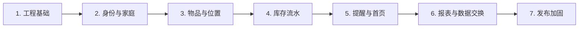

# Zija 交付路线实施计划

> **致自动化执行者：** 必须使用子技能 superpowers:subagent-driven-development（推荐）或 superpowers:executing-plans 逐任务执行本计划。步骤使用复选框（`- [ ]`）语法进行跟踪。

**目标：** 将知家（zija）首个生产就绪版本分为七个可独立测试的增量进行交付，从可执行的工程基线开始，到经过验证的私有部署、备份、恢复和升级工作流结束。

**架构：** 构建一个 API 优先的模块化单体，包含 Vue 桌面管理客户端、Spring Boot 后端和 PostgreSQL。每个阶段扩展同一个可部署系统，保持模块边界，并以浏览器可见的行为和自动化验证结束；后续阶段不得绕过库存流水或在前端复制领域规则。

**技术栈：** Java 25、Spring Boot 4.1.x、Spring Modulith 2.0.x、MyBatis、MyBatis-Plus 3.5.x、Flyway、PostgreSQL 17+、Vue 3、TypeScript、Vite、Element Plus、Vitest、Playwright、Testcontainers、Docker Compose、Nginx、GitHub Actions

---

## 事实来源

- 产品与架构规格：`docs/superpowers/specs/2026-07-18-zija-design.md`
- 阶段一可执行计划：`docs/superpowers/plans/2026-07-19-foundation-baseline.md`
- 后续阶段在执行前各自获得独立的实施计划文件。不得仅凭此路线图启动阶段。

## 全局交付规则

每个阶段在下一阶段开始前必须满足以下所有条件：

- 用户可以从桌面 Web UI 完成该阶段的主要工作流。
- 后端模块边界通过 `ApplicationModules.of(ZijaApplication.class).verify()` 验证。
- PostgreSQL 集成测试使用 Testcontainers 而非 H2 或模拟 SQL 行为。
- 任何数据库模式变更都由仅前进的 Flyway 迁移表示。
- 后端测试、前端测试、生产构建和适用的 Playwright 场景全部通过。
- Docker Compose 从空数据目录启动并报告服务健康。
- 文档描述了新工作流、配置和回滚或恢复行为。
- 阶段结束时有一组聚焦的 Git 提交和干净的工作树。

## 依赖流



## 阶段一：工程基础

**目的：** 在业务功能添加之前，建立可重复的开发、测试、构建和部署基线。

**规格覆盖：** 第 8–13 节，仅限基础设施和公开的系统状态切片。

**必须达成的结果：**

- Maven 构建的 Java 25 Spring Boot 应用位于 `backend/` 下。
- Spring Modulith 模块验证和生成的模块画布。
- MyBatis-Plus Spring Boot 4 集成、PostgreSQL 和 Flyway 基线。
- 一个公开的 `GET /api/v1/system/info` 端点，由真实 PostgreSQL 查询支持。
- Vue 3 + TypeScript + Element Plus 桌面端外壳位于 `frontend/` 下。
- 外壳根据后端数据渲染实时应用和数据库状态。
- Nginx、后端和 PostgreSQL Docker 镜像通过 `compose.yaml` 一起启动。
- 稳定的 `make` 命令和 CI 检查覆盖后端、前端、集成、构建和 Compose 冒烟测试。

**验收门槛：** 安装锁定的前端依赖和 Chromium 后，干净的检出可以运行 `make verify`、`make compose-smoke` 和 `make e2e-smoke`；浏览器测试看到“系统运行正常”，后端就绪探针为 `UP`，隔离的冒烟服务变为健康状态。

- [ ] 完整执行 `docs/superpowers/plans/2026-07-19-foundation-baseline.md`。
- [ ] 在阶段完成记录中记录最终验证命令和提交 ID。

## 阶段二：身份与家庭

**目的：** 创建单家庭安全边界和三种已批准的成员角色。

**规格覆盖：** 第 3.1、4、6.1、9 和 10 节。

**必须达成的结果：**

- 首次引导恰好创建一次家庭和所有者。
- 用户名/密码登录使用服务端会话、HttpOnly Cookie、CSRF 防护和登录限流。
- 所有者创建限时、单次邀请链接，无需 SMTP。
- 所有者、管理员和成员权限符合规格中的角色矩阵。
- 所有者和管理员可以停用成员；历史记录仍可归属于已停用账户。
- 容器维护命令创建一次性的所有者恢复链接。
- 审计记录覆盖登录、邀请、成员状态和角色变更。
- OpenAPI 生成和契约检查覆盖公开的系统、会话、引导、邀请和成员 API。

**验收门槛：** Playwright 覆盖引导、登录、邀请兑换、角色执行、登出、会话过期和被拒绝的特权操作；后端授权测试证明直接 API 调用无法绕过 UI。

- [ ] 在源码变更前编写并审批独立的身份与家庭实施计划。
- [ ] 执行已审批的计划并通过阶段验收门槛。

## 阶段三：物品与位置

**目的：** 让成员定义可复用的物品元数据和家庭的物理存放树。

**规格覆盖：** 第 5.1–5.2、6.2–6.3、6.9 和 7 节。

**必须达成的结果：**

- 物品支持消耗品/耐用品类型、分类、品牌、基础单位、标签、备注、封面图片、低库存阈值和提醒覆盖。
- 单位定义是否允许小数及其精度。
- 被引用的物品归档而非物理删除。
- 位置节点支持新增、重命名、排序和子树移动，同时防止循环。
- 有库存或子节点的位置不能删除。
- 封面上传接受 JPEG、PNG 和 WebP，上限 5 MiB，持久化在 PostgreSQL 之外。
- 桌面页面使用已批准的侧边栏、表格、抽屉和表单交互模式。

**验收门槛：** 成员可以从 Web UI 创建物品和位置层级、上传封面、归档物品，并通过 API 和 UI 测试观察所有验证规则。

- [ ] 在源码变更前编写并审批独立的物品与位置实施计划。
- [ ] 执行已审批的计划并通过阶段验收门槛。

## 阶段四：库存流水

**目的：** 交付批次、库存位和不可变流水的核心可审计库存模型。

**规格覆盖：** 第 5.3、6.4–6.5、8.5 和 11.2 节。

**必须达成的结果：**

- 批次支持购入日期、生产日期、到期日、批次号、序列号和备注。
- 库存位按批次和位置唯一，数量不得为负。
- 流水类型为入库、领用、报损、盘点调整、移位和冲正。
- 库存命令使用幂等标识和显式的 MyBatis `SELECT ... FOR UPDATE` SQL。
- 移位在一个事务中更新来源和目标库存位。
- 冲正创建补偿流水并保留原始记录。
- 盘点按位置发起，每个确认差异都需要填写原因。
- 内部一致性检查比对库存位和不可变流水。

**验收门槛：** 并发集成测试证明两个消费者无法超支同一批库存、重试一个幂等标识不会重复创建流水，以及每个结果余额都可从流水重建。

- [ ] 在源码变更前编写并审批独立的库存流水实施计划。
- [ ] 执行已审批的计划并通过阶段验收门槛。

## 阶段五：提醒与任务首页

**目的：** 将到期和低库存数据转化为可操作的家庭任务。

**规格覆盖：** 第 6.6–6.7 节和已批准的任务与风险首页方向。

**必须达成的结果：**

- 家庭到期默认值初始为提前 30 天、7 天和 1 天，允许物品覆盖或禁用。
- 家庭低库存默认值初始为 1 个基础单位，允许物品覆盖或禁用。
- 任务支持打开、稍后提醒、完成和忽略状态。
- 库存和批次事件在事务提交后可靠地更新任务。
- 首页显示七天内到期、低库存、待盘点数量、优先任务、快速操作和最近流水。
- 站内通知无需外部服务即可工作；SMTP 添加可选摘要和紧急邮件。
- 领用或报损受影响批次会关闭或重新计算任务。

**验收门槛：** 变更库存或到期日恰好创建、更新和关闭预期任务一次，包括在模拟事件处理器失败和重试之后。

- [ ] 在源码变更前编写并审批独立的提醒与首页实施计划。
- [ ] 执行已审批的计划并通过阶段验收门槛。

## 阶段六：报表与数据交换

**目的：** 使家庭数据可搜索、可审计、可移植且可安全迁移。

**规格覆盖：** 第 6.8、7.1–7.2 和 9 节。

**必须达成的结果：**

- 全局搜索覆盖物品名称、品牌、标签、批次号、序列号和位置名称。
- 报表覆盖当前库存、位置分布、到期、低库存和流水历史。
- MyBatis XML 拥有复杂报表 SQL；查询参数保持绑定且防注入。
- CSV 导入解析为预览，报告行级错误，在管理员确认前不写入任何内容。
- 确认的导入按导入任务原子执行，创建可审计的领域记录而非绕过服务。
- 导出遵循当前筛选条件并提供完整的可移植数据集。
- 导入和导出操作被审计。

**验收门槛：** 包含有效行、无效行、重复、小数单位和多个批次的代表性 CSV 产生确定性预览；修正后的输入原子导入，导出数据与数据库核对一致。

- [ ] 在源码变更前编写并审批独立的报表与数据交换实施计划。
- [ ] 执行已审批的计划并通过阶段验收门槛。

## 阶段七：发布加固

**目的：** 产出一个可以安全安装、监控、备份、恢复和升级的私有部署版本。

**规格覆盖：** 第 10–13 节和所有运维验收标准。

**必须达成的结果：**

- 生产配置要求外部密钥和可识别 HTTPS 的安全 Cookie 设置。
- 结构化日志包含请求 ID，不含密码、会话、恢复链接或敏感配置值。
- 健康端点区分存活和就绪。
- 性能检查覆盖规格中目标家庭规模和 P95 延迟目标。
- 备份在一个备份 ID 下捕获 `pg_dump`、封面文件、清单、应用版本和校验和。
- 恢复到空环境运行 Flyway、验证文件引用并核对库存位。
- 升级冒烟测试证明受支持的先前数据库可以迁移到新版本。
- 部署、备份、恢复、升级、故障排除和发行说明完整。

**验收门槛：** 候选版本使用发布的 Docker 镜像和文档通过安全、性能、空安装、备份/恢复和升级冒烟工作流。

- [ ] 在源码变更前编写并审批独立的发布加固实施计划。
- [ ] 执行已审批的计划并通过阶段验收门槛。

## 规格覆盖矩阵

| 规格领域 | 负责阶段 |
|---|---|
| 产品边界和私有部署 | 1、7 |
| 家庭、成员、角色、会话、邀请 | 2 |
| 物品、单位、分类、标签、封面 | 3 |
| 位置层级 | 3 |
| 批次、库存位、流水、盘点、冲正 | 4 |
| 到期和低库存规则与任务 | 5 |
| 任务与风险首页 | 5 |
| 搜索、报表、CSV 导入导出 | 6 |
| API 约定和 OpenAPI | 1 建立版本控制和错误处理；2 引入生成的契约；3–6 扩展；7 验证 |
| 安全和审计 | 1 建立；2–7 扩展 |
| 备份、恢复、升级、性能 | 7 |
| 后续 Android 和 iOS 客户端 | v1 之后；不属于这七个阶段 |

## 最终 V1 完成门槛

只有当所有七个阶段都已勾选，并且以下命令链从干净检出成功执行时，首个版本才算完成：

```bash
make verify
make compose-smoke
make backup-test
make restore-smoke
```

预期结果：每个命令退出状态为 `0`，Git 工作树干净，发行说明标识所使用的确切后端、前端、数据库和容器版本。
