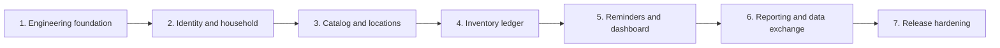

# Zija Delivery Roadmap Implementation Plan

> **For agentic workers:** REQUIRED SUB-SKILL: Use superpowers:subagent-driven-development (recommended) or superpowers:executing-plans to implement this plan task-by-task. Steps use checkbox (`- [ ]`) syntax for tracking.

**Goal:** Deliver the first production-ready version of 知家（zija）as seven independently testable increments, beginning with an executable engineering baseline and ending with verified private deployment, backup, restore, and upgrade workflows.

**Architecture:** Build one API-first modular monolith with a Vue desktop administration client, a Spring Boot backend, and PostgreSQL. Each phase extends the same deployable system, preserves module boundaries, and finishes with browser-visible behavior plus automated verification; later phases must not bypass the inventory ledger or duplicate domain rules in the frontend.

**Tech Stack:** Java 25, Spring Boot 4.1.x, Spring Modulith 2.0.x, MyBatis, MyBatis-Plus 3.5.x, Flyway, PostgreSQL 17+, Vue 3, TypeScript, Vite, Element Plus, Vitest, Playwright, Testcontainers, Docker Compose, Nginx, GitHub Actions

---

## Source of Truth

- Product and architecture specification: `docs/superpowers/specs/2026-07-18-zija-design.md`
- Phase 1 executable plan: `docs/superpowers/plans/2026-07-19-foundation-baseline.md`
- Later phases receive their own file-specific implementation plan immediately before execution. A phase may not begin from this roadmap alone.

## Global Delivery Rules

Every phase must satisfy all of the following before the next phase starts:

- A user can complete the phase's primary workflow from the desktop Web UI.
- Backend module boundaries pass `ApplicationModules.of(ZijaApplication.class).verify()`.
- PostgreSQL integration tests use Testcontainers rather than H2 or mocked SQL behavior.
- Any schema change is represented by a forward-only Flyway migration.
- Backend tests, frontend tests, production builds, and applicable Playwright scenarios pass.
- Docker Compose starts from an empty data directory and reports healthy services.
- Documentation describes the new workflow, configuration, and rollback or recovery behavior.
- The phase ends with a focused Git commit series and a clean worktree.

## Dependency Flow



## Phase 1: Engineering Foundation

**Purpose:** Establish a repeatable development, test, build, and deployment baseline before business features are added.

**Specification coverage:** Sections 8–13, limited to infrastructure and the public system-status slice.

**Required outcomes:**

- Maven-based Java 25 Spring Boot application under `backend/`.
- Spring Modulith module verification and generated module canvases.
- MyBatis-Plus Spring Boot 4 integration, PostgreSQL, and Flyway baseline.
- A public `GET /api/v1/system/info` endpoint backed by a real PostgreSQL query.
- Vue 3 + TypeScript + Element Plus desktop shell under `frontend/`.
- The shell renders live application and database status from the backend.
- Nginx, backend, and PostgreSQL Docker images start together through `compose.yaml`.
- Stable `make` commands and CI checks cover backend, frontend, integration, build, and Compose smoke tests.

**Acceptance gate:** After installing locked frontend dependencies and Chromium, a clean checkout can run `make verify`, `make compose-smoke`, and `make e2e-smoke`; the browser test sees “系统运行正常”, the backend readiness probe is `UP`, and the isolated smoke services become healthy.

- [ ] Execute `docs/superpowers/plans/2026-07-19-foundation-baseline.md` in full.
- [ ] Record the final verification commands and commit IDs in the phase completion note.

## Phase 2: Identity and Household

**Purpose:** Create the single-household security boundary and the three approved member roles.

**Specification coverage:** Sections 3.1, 4, 6.1, 9, and 10.

**Required outcomes:**

- First-run bootstrap creates the household and owner exactly once.
- Username/password login uses server-side sessions, HttpOnly cookies, CSRF protection, and login throttling.
- Owner creates time-limited, one-use invitation links without requiring SMTP.
- Owner, administrator, and member permissions match the role matrix in the specification.
- Owners and administrators can disable members; history remains attributable to disabled accounts.
- Container maintenance command creates a one-time owner recovery link.
- Audit records cover login, invitation, member state, and role changes.
- OpenAPI generation and contract checks cover the public system, session, bootstrap, invitation, and member APIs.

**Acceptance gate:** Playwright covers bootstrap, login, invite redemption, role enforcement, logout, session expiry, and a denied privileged action; backend authorization tests prove direct API calls cannot bypass the UI.

- [ ] Write and approve a dedicated identity-and-household implementation plan before source changes.
- [ ] Execute the approved plan and pass the phase acceptance gate.

## Phase 3: Catalog and Locations

**Purpose:** Let members define reusable item metadata and the household's physical storage tree.

**Specification coverage:** Sections 5.1–5.2, 6.2–6.3, 6.9, and 7.

**Required outcomes:**

- Items support consumable/durable type, category, brand, base unit, tags, note, cover image, low-stock threshold, and reminder override.
- Units define whether fractional quantities are allowed and their scale.
- Referenced items are archived rather than physically deleted.
- Location nodes support create, rename, sort, and subtree move while preventing cycles.
- Locations with children or stock cannot be deleted.
- Cover uploads accept JPEG, PNG, and WebP up to 5 MiB and persist outside PostgreSQL.
- Desktop pages use the approved sidebar, table, drawer, and form interaction patterns.

**Acceptance gate:** A member can create an item and location hierarchy from the Web UI, upload a cover, archive the item, and observe all validation rules through both API and UI tests.

- [ ] Write and approve a dedicated catalog-and-locations implementation plan before source changes.
- [ ] Execute the approved plan and pass the phase acceptance gate.

## Phase 4: Inventory Ledger

**Purpose:** Deliver the core auditable inventory model for lots, stock positions, and immutable movements.

**Specification coverage:** Sections 5.3, 6.4–6.5, 8.5, and 11.2.

**Required outcomes:**

- Lots support purchase date, production date, expiry date, lot number, serial number, and notes.
- Stock positions are unique by lot and location and never become negative.
- Movement types are inbound, consume, loss, adjustment, transfer, and reversal.
- Inventory commands use idempotency keys and explicit MyBatis `SELECT ... FOR UPDATE` SQL.
- Transfer updates source and target positions in one transaction.
- Reversal creates a compensating movement and preserves the original record.
- Count sessions operate by location and require a reason for every confirmed difference.
- Internal reconciliation compares stock positions with the immutable ledger.

**Acceptance gate:** Concurrent integration tests prove that two consumers cannot overspend the same stock, retrying one idempotency key cannot duplicate a movement, and every resulting balance is reconstructible from the ledger.

- [ ] Write and approve a dedicated inventory-ledger implementation plan before source changes.
- [ ] Execute the approved plan and pass the phase acceptance gate.

## Phase 5: Reminders and Task Dashboard

**Purpose:** Turn expiry and low-stock data into actionable household tasks.

**Specification coverage:** Sections 6.6–6.7 and the approved task-and-risk homepage direction.

**Required outcomes:**

- Household expiry defaults begin at 30, 7, and 1 day and allow item overrides or disablement.
- Household low-stock default begins at one base unit and allows item overrides or disablement.
- Tasks support open, snoozed, done, and ignored states.
- Inventory and lot events reliably update tasks after transaction commit.
- Dashboard shows seven-day expiry, low stock, pending counts, priority tasks, quick actions, and recent movements.
- Site notifications work without external services; SMTP adds optional summaries and urgent mail.
- Consuming or recording loss against the affected lot closes or recalculates the task.

**Acceptance gate:** Changing stock or expiry creates, updates, and closes the expected tasks exactly once, including after a simulated event-handler failure and retry.

- [ ] Write and approve a dedicated reminders-and-dashboard implementation plan before source changes.
- [ ] Execute the approved plan and pass the phase acceptance gate.

## Phase 6: Reporting and Data Exchange

**Purpose:** Make household data searchable, auditable, portable, and safe to migrate.

**Specification coverage:** Sections 6.8, 7.1–7.2, and 9.

**Required outcomes:**

- Global search covers item name, brand, tag, lot number, serial number, and location name.
- Reports cover current stock, location distribution, expiry, low stock, and movement history.
- MyBatis XML owns complex reporting SQL; query parameters remain bound and injection-safe.
- CSV import parses into a preview, reports row-level errors, and writes nothing before administrator confirmation.
- Confirmed import is atomic per import job and creates auditable domain records rather than bypassing services.
- Exports honor active filters and provide a complete portable dataset.
- Import and export actions are audited.

**Acceptance gate:** A representative CSV containing valid rows, invalid rows, duplicates, fractional units, and multiple lots produces a deterministic preview; corrected input imports atomically and exported data reconciles with the database.

- [ ] Write and approve a dedicated reporting-and-data-exchange implementation plan before source changes.
- [ ] Execute the approved plan and pass the phase acceptance gate.

## Phase 7: Release Hardening

**Purpose:** Produce a private-deployment release that can be installed, monitored, backed up, restored, and upgraded safely.

**Specification coverage:** Sections 10–13 and all operational acceptance criteria.

**Required outcomes:**

- Production configuration requires external secrets and HTTPS-aware secure-cookie settings.
- Structured logs include request IDs without passwords, sessions, recovery links, or secret values.
- Health endpoints distinguish liveness and readiness.
- Performance checks cover the specification's target household scale and P95 latency goals.
- Backup captures `pg_dump`, cover files, manifest, application version, and checksum under one backup ID.
- Restore into an empty environment runs Flyway, validates file references, and reconciles stock positions.
- Upgrade smoke tests prove a supported prior database can migrate to the release.
- Deployment, backup, restore, upgrade, troubleshooting, and release notes are complete.

**Acceptance gate:** A release candidate passes security, performance, empty-install, backup/restore, and upgrade smoke workflows using the published Docker images and documentation.

- [ ] Write and approve a dedicated release-hardening implementation plan before source changes.
- [ ] Execute the approved plan and pass the phase acceptance gate.

## Specification Coverage Matrix

| Specification area | Owning phase |
|---|---|
| Product boundary and private deployment | 1, 7 |
| Household, member, role, session, invitation | 2 |
| Item, unit, category, tag, cover | 3 |
| Location hierarchy | 3 |
| Lot, stock position, movement, count, reversal | 4 |
| Expiry and low-stock rules and tasks | 5 |
| Task-and-risk dashboard | 5 |
| Search, report, CSV import/export | 6 |
| API conventions and OpenAPI | 1 establishes versioning and errors; 2 introduces generated contracts; 3–6 extend; 7 verifies |
| Security and audit | 1 establishes; 2–7 extend |
| Backup, restore, upgrade, performance | 7 |
| Future Android and iOS clients | Post-v1; not part of these seven phases |

## Final V1 Completion Gate

The first version is complete only when all seven phases are checked and the following command chain succeeds from a clean checkout:

```bash
make verify
make compose-smoke
make backup-test
make restore-smoke
```

Expected result: every command exits with status `0`, the Git worktree is clean, and the release documentation identifies the exact backend, frontend, database, and container versions used.
